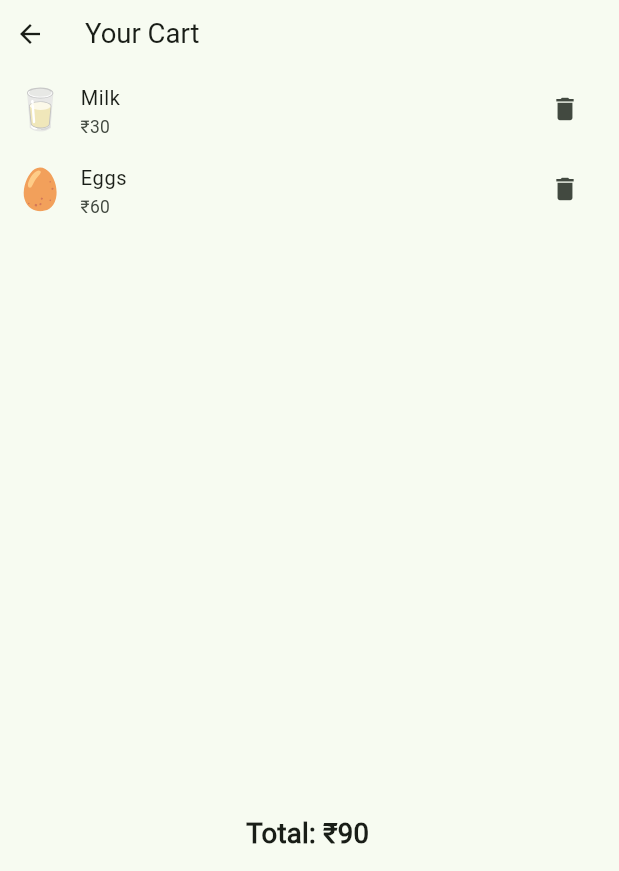
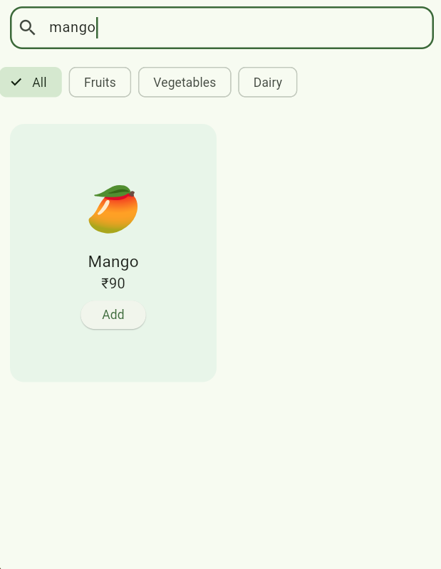

# 📱 Smart Grocery App

A simple and clean **Flutter Grocery App** built for practice, UI learning, and fresher interview projects.  
This app includes item browsing, search, category filtering, and a cart system with mock backend data.

---

## 🚀 Features

- 🔍 **Search Grocery Items**
- 🥦 **Filter by Categories** (Fruits, Vegetables, Dairy)
- 🛒 **Add / Remove items from Cart**
- 🎨 Animated Item Cards for smooth UI
- 🌈 Clean Material UI with custom colors
- 🌐 Runs on **Android, iOS, and Web**
- 📂 Clean folder structure (`lib/screens/`, `lib/models/`, `lib/widgets/`, `lib/data/`)

---
## 📸 App Screenshots

Store screenshots in the `screenshots/` folder of this repository.

### 🔹 Home Screen  

### 🔹 Cart Screen  

### 🔹 Search Screen 

