# 🛒 Fresh Mart - Smart Grocery App

[](https://flutter.dev/)
[](https://firebase.google.com/)
[](https://dart.dev/)

Fresh Mart is a **modern Grocery E-commerce mobile application** built using **Flutter** and **Firebase**.
The app provides a smooth grocery shopping experience where users can browse products, search items, manage cart, and simulate a realistic checkout process.

This project follows **Clean Architecture (MVVM)** principles and uses **Provider** for efficient state management.

---

## 🚀 Features

- 🔐 **Authentication**: Firebase Email & Password authentication.
- 📦 **Product Catalog**: Live grocery data from **DummyJSON REST API**.
- 🔍 **Smart Search**: Real-time search and category-based filtering.
- 🛒 **Cart System**: Add/Remove items, quantity control, and dynamic delivery charges.
- 💳 **Checkout Flow**: Premium bottom sheet for payment method selection.
- 🎨 **Modern UI**: Emerald Green theme, responsive design, and Material 3.

---

## 📸 App Screenshots

### 🔹 Onboarding & Authentication
| Splash Screen | Login Screen | Register Screen |
| :---: | :---: | :---: |
| 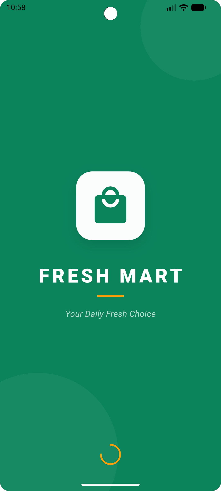 | 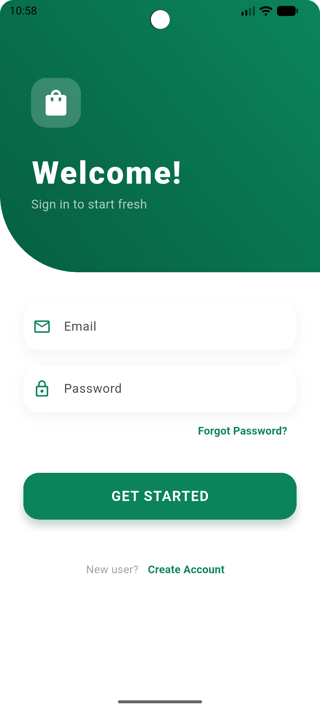 | 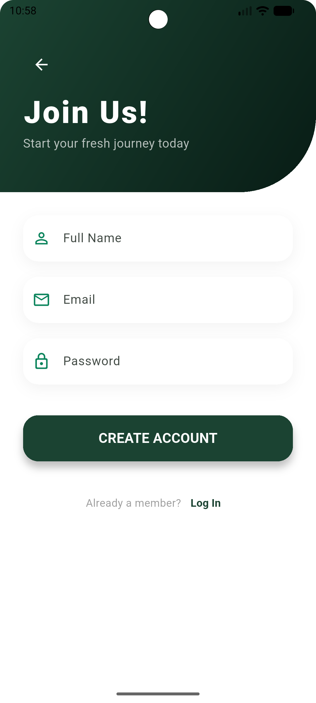 |

### 🔹 Browsing & Discovery
| Home Screen | Categories | Category Products |
| :---: | :---: | :---: |
| 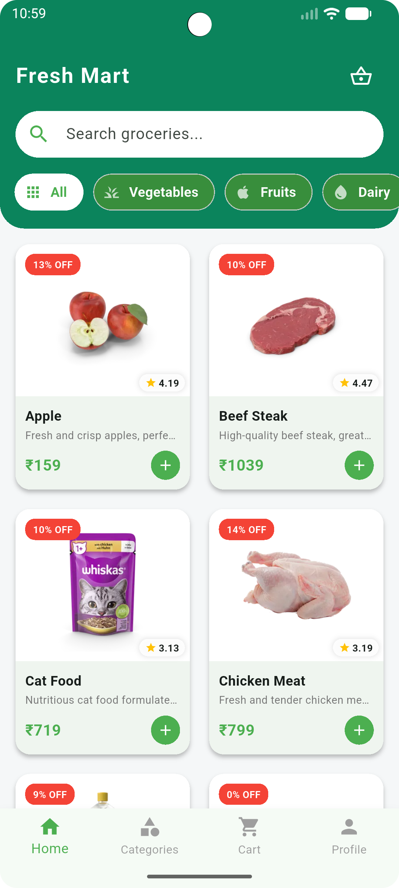 | 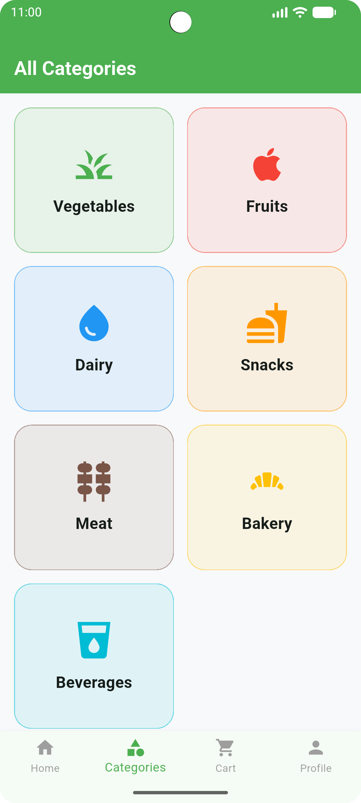 | 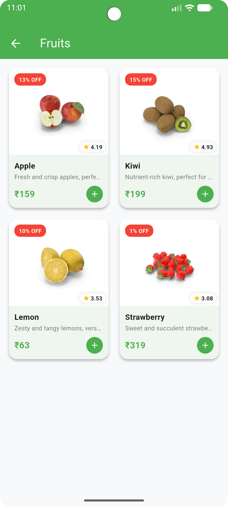 |

### 🔹 Shopping & Cart
| Search Filter | Active Cart | Empty Cart |
| :---: | :---: | :---: |
| 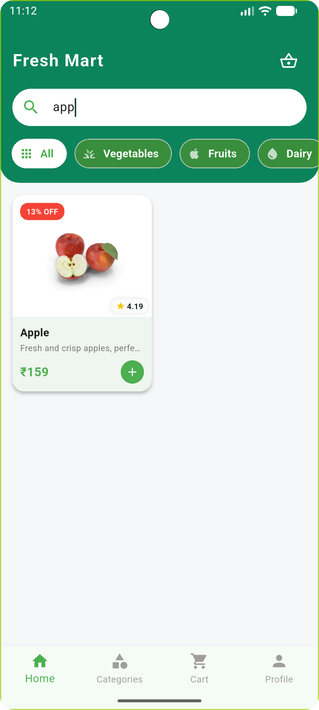 | 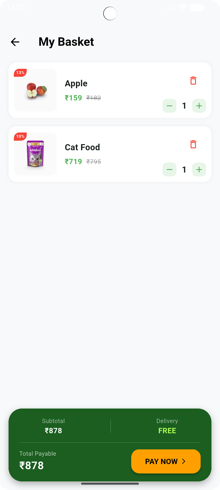 | 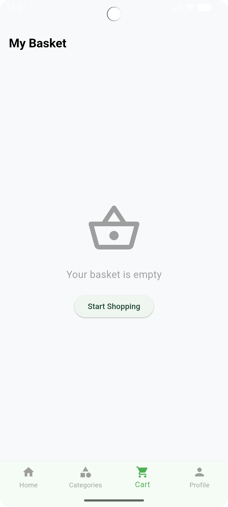 |

### 🔹 Checkout & Profile
| Payment Selection | Processing | Order Success | Profile Page |
| :---: | :---: | :---: | :---: |
| 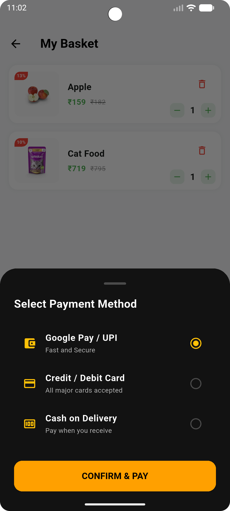 | 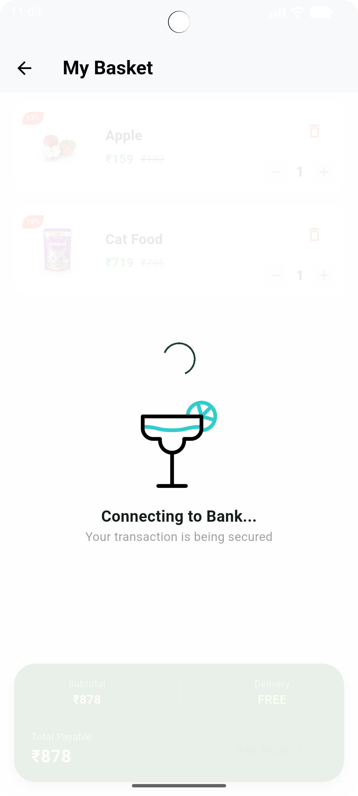 | 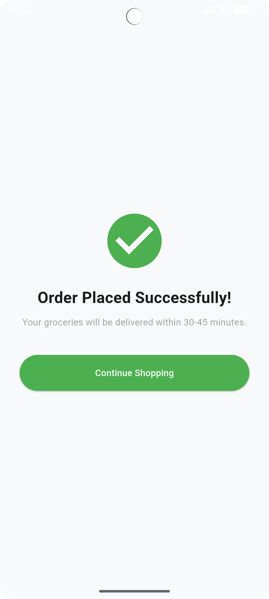 | 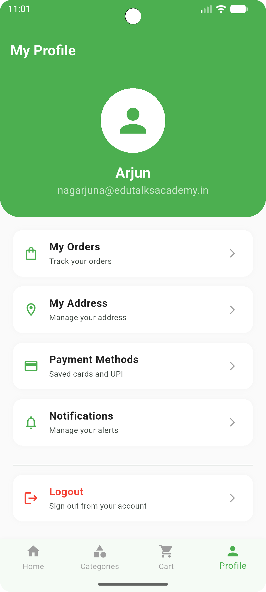 |

---

## 📂 Project Structure

```
lib/
├── models/          # Product and User models
├── services/        # API and Payment services
├── providers/       # Auth, Cart, and Product state management
├── screens/         # UI Screens (Home, Cart, Auth, etc.)
├── widgets/         # Reusable UI components
└── main.dart        # Entry point and Firebase initialization
```

---

## ⚙️ Setup & Installation

1. **Clone the repo:** `git clone https://github.com/Arjun-flutter/grocery_app.git'
2. **Install dependencies:** `flutter pub get`
3. **Firebase:** Place `google-services.json` in `android/app/`.
4. **Run:** `flutter run`

---

Developed with ❤️ by **Nagarjuna Reddy Avula**
